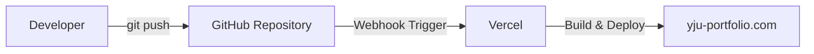

# [yju-portfolio](https://yju-portfolio.com)

## 개요

개인 프로젝트 | 2025.01

> 프론트엔드 개발 역량을 효과적으로 보여줄 수 있는 형식을 고민한 끝에, 웹사이트 형태의 포트폴리오를 직접 기획하고 개발했다.

## 기술 스택

| 스택                                                                                                  | 버전     | 기타       |
| ----------------------------------------------------------------------------------------------------- | -------- | ---------- |
|        | `15`     | App Router |
|            | `19`     |
|  | `5`      |
|              | `1.83.3` |
|          |          | Deploy     |

## 주요 기능

### 반응형 웹

밝은 배경과 라임색 포인트를 중심으로 화면을 구성하고, 모바일부터 데스크톱까지 레이아웃이 자연스럽게 바뀌도록 적용했다. 키보드 탐색과 모션 감소 설정을 지원한다.

### 인터랙티브 탐색

첫 화면의 그래픽은 포인터에 반응하며 Bloom·Orbit·Grid 모양을 선택할 수 있다. 회전을 일시정지할 수 있고, 모션 감소 설정에서는 애니메이션을 최소화한다.

프로젝트는 카테고리로 필터링하고, 기술은 분야별 탭과 숙련도 상세 보기로 탐색할 수 있다. 경력의 세부 성과는 아코디언으로 펼쳐볼 수 있으며, 연락처에서는 이메일 보내기와 주소 복사를 지원한다.

### 모달창 띄우기

프로젝트 카드를 클릭하면 `/project/[key]` 경로로 이동하지만, 메인 페이지에서의 클라이언트 이동은 Next.js App Router의 패러럴 라우팅과 인터셉트 라우팅으로 가로채 모달 형태로 상세를 띄우도록 구현했다. `@projectModal` 슬롯에 `(.)project/[key]` 경로를 두어 현재 메인 화면과 스크롤 위치를 유지한 채 상세 정보를 오버레이로 보여주고, 주소를 직접 입력하거나 새로고침한 경우에는 동일한 URL이 독립 페이지로 렌더링되도록 구성했다. 덕분에 공유 가능한 URL 구조와 모달 UX를 함께 가져가면서도, 별도의 전역 상태에 의존하지 않고 라우팅만으로 상세 화면을 일관되게 제어할 수 있었다.

## 기여도와 역할

1인 프로젝트로 기획, 디자인, 개발, SEO 대응, 배포까지 전 과정을 직접 수행했다.

## 트러블 슈팅

### 멀티 플랫폼 지원

#### 기기

기존에는 스크롤에 따라 선 색상이 바뀌는 효과를 `linear-gradient`와 `background-attachment: fixed`로 구현했다. 하지만 Safari에서 `background-attachment: fixed`가 정상 동작하지 않아 JavaScript 기반 로직으로 대체했고, 그 결과 브라우저 간 일관된 사용자 경험을 유지할 수 있었다.

#### 브라우저

구글 검색 결과에는 정상 노출되었지만, 네이버 검색 결과에는 잘 잡히지 않는 이슈가 있었다. 이 프로젝트에서는 App Router 구조에 맞춰 `favicon`과 `robots.txt`를 정리한 뒤 노출 상태가 개선되었다.

### 배포

직접 호스팅 하기엔 관리 부담이 커서 무료 호스팅이 가능하게 진행하였다.

GitHub에 push하면 Vercel이 자동으로 빌드 및 배포를 수행하도록 구성해 배포 과정을 단순화하였다.



### [h1 태그 SEO 개선](https://velog.io/@yp071704/h1h6-태그의-중요성)

페이지당 `<h1>`은 하나만 사용하고, `<h1>` → `<h2>` → `<h3>`처럼 문서 구조를 논리적으로 계층화해야 한다.

## 결과 및 성과

### Next.js 로 SEO(검색 엔진 최적화)

측정 당시 기준으로 `양정운 포트폴리오`, `개발자 양정운`, `프론트 양정운` 검색어에서 구글과 네이버 검색 결과 상단에 노출되었다.

<picture>
  <source
    srcset="https://raw.githubusercontent.com/yp-un/yju-portfolio/main/public/portfolio/images/dark/search.webp"
    media="(prefers-color-scheme: dark)"
  />
  
</picture>

## 로컬 실행

```sh
npm install
npm run dev
```

`.env`의 `NEXT_PUBLIC_BASE_URL`, `NEXT_PUBLIC_EMAIL`, `NEXT_PUBLIC_PHONE`, `NEXT_PUBLIC_GA_ID`에 사이트 주소, 공개 연락처와 분석 설정을 지정한다.

```sh
npm run lint
npx tsc --noEmit
npm run build
```

프로젝트 정보는 `src/app/_constants/projects.ts`, 카드 표시 정보는 `src/app/_sections/projects/projectPresentation.ts`, 이미지와 상세 설명은 `public/{project-key}/`에서 관리한다.
