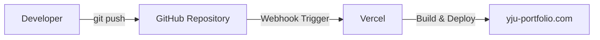

# [yju-portfolio](https://yju-portfolio.com)

## 개요

개인 프로젝트 | 2025.01

> 프론트엔드 개발 역량을 효과적으로 보여줄 수 있는 형식을 고민한 끝에, 웹사이트 형태의 포트폴리오를 직접 기획하고 개발했다.

## 기술 스택

| 스택                                                                                                  | 버전     | 기타       |
| ----------------------------------------------------------------------------------------------------- | -------- | ---------- |
|        | `15`     | App Router |
|            | `19`     |
|  | `5`      |
|                     | `5`      |
|              | `1.83.3` |
|          |          | Deploy     |

## 주요 기능

### 반응형 웹

화면 크기에 따라 레이아웃과 인터랙션이 자연스럽게 변경되도록 하고, 사용자의 기기 테마 설정에 맞춰 라이트/다크 테마가 자동으로 전환되도록 적용해 일관된 사용자 경험을 제공했다.

## 기여도와 역할

1인 프로젝트로 기획, 디자인, 개발, SEO 대응, 배포까지 전 과정을 직접 수행했다.

## 트러블 슈팅

### 멀티 플랫폼 지원

#### 기기

기존에는 스크롤에 따라 선 색상이 바뀌는 효과를 `linear-gradient`와 `background-attachment: fixed`로 구현했다. 하지만 Safari에서 `background-attachment: fixed`가 정상 동작하지 않아 JavaScript 기반 로직으로 대체했고, 그 결과 브라우저 간 일관된 사용자 경험을 유지할 수 있었다.

#### 브라우저

구글 검색 결과에는 정상 노출되었지만, 네이버 검색 결과에는 잘 잡히지 않는 이슈가 있었다. 이 프로젝트에서는 App Router 구조에 맞춰 `favicon`과 `robots.txt`를 정리한 뒤 노출 상태가 개선되었다.

### 배포

직접 호스팅 하기엔 관리 부담이 커서 무료 호스팅이 가능하게 진행하였다.

GitHub에 push하면 Vercel이 자동으로 빌드 및 배포를 수행하도록 구성해 배포 과정을 단순화하였다.

### [h1 태그 SEO 개선](https://velog.io/@yp071704/h1h6-태그의-중요성)

페이지당 `<h1>`은 하나만 사용하고, `<h1>` → `<h2>` → `<h3>`처럼 문서 구조를 논리적으로 계층화해야 한다.

## 결과 및 성과

### Next.js 로 SEO(검색 엔진 최적화)

측정 당시 기준으로 `양정운 포트폴리오`, `개발자 양정운`, `프론트 양정운` 검색어에서 구글과 네이버 검색 결과 상단에 노출되었다.

