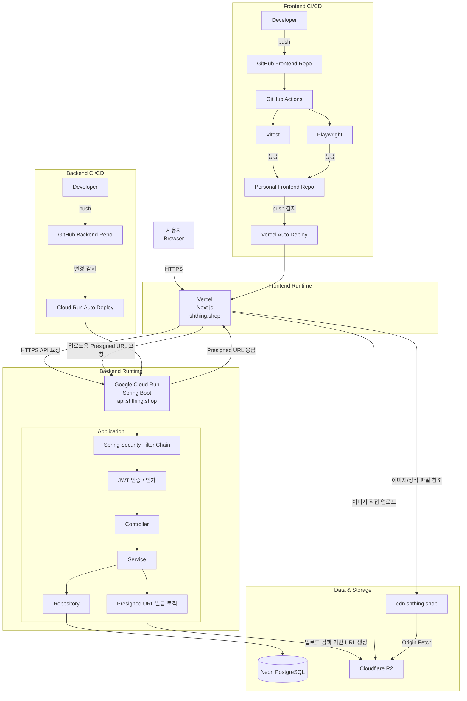

# [Shathing](https://shathing.shop)

## 개요

개인 프로젝트 | 2026.01 ~ 2026.03

> 이전부터 만들고 싶었던 물건 공유 플랫폼을 프론트엔드부터 백엔드, 배포까지 직접 구현했다. 또한 단순한 개발로 끝내지 않고 실제 운영까지 고려해 인프라 비용을 최소화하는 방향으로 설계했다.

## 기술 스택

| 스택                                                                                                     | 버전 | 기타                 |
| -------------------------------------------------------------------------------------------------------- | ---- | -------------------- |
|           | `16` | App Router           |
|               | `19` |
|     | `5`  |
|                        | `5`  | 클라이언트 상태 관리 |
|     | `5`  | 서버 상태 관리       |
|  | `4`  |
|             |      | FE Deploy            |
|    | `4`  |
|                           | `17` |
|     |      | BE Deploy            |
|     | `17` |
|                           |      | DB Deploy            |
|             |      | Object Storage       |
|             |      | Error Monitoring     |

## 주요 기능

- 공유 물건 조회/등록/수정/삭제

- 채팅

- 다국어

## 기여도와 역할

1인 프로젝트로 기획, 개발, 인프라 배포까지 전 과정을 직접 수행했다. Next.js 기반 프론트엔드와 Spring Boot 기반 백엔드를 각각 설계 및 구현했고, Vercel, Cloud Run, Neon, R2 조합으로 운영 환경까지 구축했다.

## 트러블 슈팅

### 서버 부담 최소화

물건 등록 시 서버 부담을 줄이기 위해 서버에는 업로드 URL만 요청하고, 실제 파일 업로드는 클라이언트가 R2에 직접 수행하는 구조를 적용했다.

### 초기 적재 방식의 비효율 개선

주소 데이터 초기 적재 과정에서 JPA가 각 행마다 개별 쿼리를 실행하는 비효율이 발생해, DB 무료 사용량이 거의 소진되는 문제가 있었다. 이를 해결하기 위해 적재 방식을 JDBC batch insert 기반의 벌크 적재로 변경하여 초기 적재 속도를 높이고 DB 사용량을 줄였다. 또한 누적된 사용량을 초기화하기 위해 새로운 DB를 생성한 뒤, `pg_dump -Fc -d "<source_unpooled>" -f backup.dump` 명령으로 기존 DB를 백업하고 `pg_restore -d "<target_unpooled_to_appdb>" backup.dump`로 복원했다. 이후 서비스의 DB URL을 신규 DB로 교체해 문제를 해결했다.

### 다국어 지원

다국어를 지원하려 했지만, 사용자 생성 콘텐츠까지 단일 방식으로 처리하기에는 품질과 운영 측면에서 한계가 있었다. 그래서 사용자 생성 글은 언어별로 별도 저장하고, 현재 선택된 언어에 맞는 데이터를 조회해 보여주는 방식으로 방향을 조정했다.

### HTML 태그의 위치

Next.js App Router에서는 `<html>` 태그를 `RootLayout`에 두는 것이 기본 구조이지만, 이 방식만으로는 locale에 따라 `lang` 속성을 유연하게 변경하기 어려웠다. 그래서 `next-intl` 예시를 참고해 `[locale]` 하위의 layout에 `<html>` 태그를 배치하고 `suppressHydrationWarning`을 적용해 경고 없이 다국어 구조를 구성했다.

### 서버 인증

기존에는 access token을 localStorage에 저장하고 헤더에 담아 인증하는 방식으로 구현했지만, 이 방식은 server side에서 인증 상태를 직접 확인하기 어렵다는 한계가 있었다. 그래서 서버에서도 읽을 수 있는 cookie 기반 인증으로 전환해 server side에서도 인증 정보를 활용할 수 있도록 변경했다.

### 쿠키 도메인

프론트는 `shthing.shop`, 백엔드는 `api.shathing.shop` 도메인을 사용하고 있어 브라우저에서 백엔드 쿠키를 서드파티 쿠키로 인식하는 문제가 있었다. 이를 해결하기 위해 쿠키 `Domain`을 상위 도메인 기준으로 맞추고, 프론트와 백엔드 요청 구조를 이에 맞게 조정해 인증 쿠키를 안정적으로 공유할 수 있도록 했다.

## 결과 및 성과

### 무료

프론트엔드, 백엔드, 데이터베이스, 오브젝트 스토리지를 모두 클라우드 환경으로 구성했음에도 사용자가 적을 땐 무료 플랜 범위 내에서 운영 가능하도록 설계했다.

## 개선점

### axios 제거

토큰 인터셉터를 위해 `axios`를 사용했지만, Next.js 환경에서는 특히 server side에서 `fetch`의 활용도가 더 높다. 추후에는 공통 `fetch` 래퍼나 `fetch` 기반 HTTP 클라이언트로 전환해 프레임워크 기본 기능을 더 적극적으로 활용할 수 있다.

### Redis 도입

현재 백엔드는 Google Cloud Run에 배포되어 있으며 다중 인스턴스 확장이 가능하다. 하지만 웹소켓 연결 상태를 인스턴스 간에 공유하려면 별도의 pub/sub 계층이 필요하다. 현재는 MVP 단계이기 때문에 인스턴스를 1개로 제한했지만, 이후 사용자가 증가하면 Redis를 도입해 pub/sub 기반으로 확장하는 구조가 필요하다.

### AWS 로 이주

현재 프로젝트는 초기 운영 비용을 최소화하기 위해 무료 플랜 중심으로 서비스를 분산 배포했다. 다만 트래픽이 증가하고 운영 복잡도가 높아지면, 장기적으로는 AWS 중심으로 인프라를 통합하는 방향을 검토할 필요가 있다.

## 서비스 아키텍처

