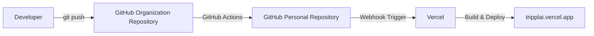

# [Tripplai](https://tripplai.vercel.app)

## 개요

5인 팀 프로젝트 | 2025.04 ~ 2025.10

> 여러 역할의 팀원과 실제 서비스 형태의 협업을 경험해보고자 프로젝트를 진행했다.

## 기술 스택

| 스택                                                                                                     | 버전 | 기타       |
| -------------------------------------------------------------------------------------------------------- | ---- | ---------- |
|           | `15` | App Router |
|               | `19` |
|     | `5`  |
|                        | `5`  |
|     | `5`  |
|  | `3`  |
|             |      | Deploy     |

## 주요 기능

- AI 여행지 추천
- 공공데이터 기반 축제 정보 제공
- Toss Payments 연동 결제 기능

## 기여도와 역할

로그인 기능 구현, Toss Payments 연동 결제 기능 구현, 공공데이터 API를 활용한 축제 정보 제공 페이지 개발을 담당했다. 축제 정보 페이지는 SSR을 적용해 검색 엔진 노출에 유리하도록 구성했다.

프로젝트 초반에는 브랜치 전략 등 협업 방식에 적응하는 단계였지만, 후반부에는 새로 합류한 팀원에게 브랜치 전략을 설명하고 코드 리뷰를 진행할 정도로 협업 이해도를 높일 수 있었다.

<!--  -->

## 트러블 슈팅

### 버전 업그레이드

기존에는 Next.js 14로 프로젝트를 시작했지만, HMR 등 Next.js 15에서 개선된 개발 경험을 반영하기 위해 버전 업그레이드를 진행했다. 업그레이드 과정에서 `await` 관련 사용 방식이 바뀌며 빌드 오류가 발생했지만, 공식 문서를 기준으로 변경 사항을 반영해 문제를 해결했다.

### CORS

초기에는 브라우저에서 공공데이터 Open API를 직접 호출해도 문제가 없었지만, 정부 데이터센터 화재 이후 API 장애가 복구되는 과정에서 CORS 이슈가 발생했다. 프로젝트 마감 기한이 가까웠기 때문에 빠르게 대응할 수 있는 방법이 필요했고, Next.js의 API Route를 중간 계층으로 두어 CORS 문제를 우회했다.

### 배포

조직 레포지토리는 Vercel 무료 플랜에서 자동 배포에 제약이 있어, GitHub Actions를 이용해 개인 레포지토리로 코드를 동기화한 뒤 Vercel이 해당 레포지토리를 기준으로 자동 빌드 및 배포를 수행하도록 구성했다.

## 결과 및 성과

`2025 관광데이터 활용 공모전` 예선 통과

## 개선점

- `pnpm`을 도입해 패키지 설치 속도와 의존성 관리 효율을 개선할 수 있다.
- `zod`를 적용해 사용자 입력값에 대한 런타임 검증을 강화할 수 있다.
