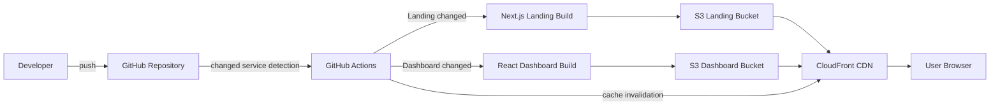

# [YourMillionaire](https://yourmillionaire.kro.kr)

## 개요

팀 프로젝트 | 2026.05

> 생성형 AI를 적극적으로 활용해 개발 속도를 높이고, 서비스 성격에 맞춰 랜딩 페이지와 대시보드를 분리해 구성한 AI 회계 서비스 프로젝트다.

## 기술 스택

| 스택                                                                                                  | 버전 | 기타           |
| ----------------------------------------------------------------------------------------------------- | ---- | -------------- |
|        |      | Landing        |
|            |      | Dashboard      |
|  |      |
|  |      | Deploy         |
|            |      | Static Hosting |
|   |      | CDN            |
|  | | CI/CD          |

## 주요 기능

- SEO 친화적인 랜딩 페이지
- AI 회계 대시보드
- 공통 디자인 시스템 기반 UI
- GitHub Actions 기반 AWS 배포 자동화

## 기여도와 역할

프론트엔드 개발과 배포 구조 설계를 담당했다. 개발 과정에서는 생성형 AI를 적극적으로 활용해 반복적인 구현과 구조 탐색 시간을 줄였고, 서비스의 성격에 따라 랜딩 페이지와 대시보드를 다른 기술 선택지로 구성했다.

랜딩 페이지는 검색 엔진 노출이 중요하기 때문에 Next.js로 개발했다. 반면 대시보드는 SEO가 필요하지 않고 사용자 인증 이후 접근하는 화면이기 때문에 React로 개발했다. 이를 통해 서버 렌더링과 클라이언트 상태 불일치에서 발생할 수 있는 hydration error 부담을 줄이고, 클라이언트 중심 화면을 더 단순하게 구현할 수 있었다.

두 프론트엔드는 서로 다른 앱으로 나뉘어 있지만, 디자인 통일성을 유지하기 위해 공통 디자인 시스템을 함께 사용했다. 덕분에 랜딩과 대시보드의 기술 스택은 분리하면서도 사용자가 느끼는 UI 일관성은 유지할 수 있었다.

## 트러블 슈팅

### Next.js 배포 구조 재검토

초기에는 Vercel 생태계를 벗어나기 위해 Next.js 앱을 AWS에 배포하는 방향으로 설계했다. 이 과정에서 SST와 OpenNext를 활용해 Vercel 외부에서도 Next.js 런타임을 운영할 수 있는 구조를 검토하고 적용했다.

하지만 현재 랜딩 페이지는 SSG만 생성되는 단계였기 때문에, Lambda 기반 런타임까지 포함하는 구조는 서비스 규모에 비해 과하다고 판단했다. 그래서 대시보드 React 앱과 동일하게 Next.js 랜딩 페이지도 정적 파일로 빌드한 뒤 S3와 CloudFront에 배포하는 구조로 단순화했다.

### AWS 기반 정적 배포

Vercel이 제공하는 편의 기능에 의존하지 않고 AWS 기반으로 배포하기 위해 S3와 CloudFront를 사용했다. S3에는 정적 빌드 결과물을 업로드하고, CloudFront를 통해 사용자에게 제공되도록 구성했다.

CloudFront를 앞단에 두어 CDN 캐싱 이점을 가져가면서도, 배포 후 변경 사항이 즉시 반영될 수 있도록 GitHub Actions 파이프라인에 캐시 무효화 과정을 포함했다.

### 서비스별 선택 빌드

랜딩 페이지와 대시보드가 분리되어 있기 때문에, 모든 프론트엔드를 매번 빌드하지 않고 수정된 서비스만 빌드 및 배포되도록 GitHub Actions 파이프라인을 구성했다. 이를 통해 변경 범위가 작을 때 불필요한 빌드 시간을 줄일 수 있었다.

### 인증 영역 분리 검토

초기에는 로그인과 회원가입처럼 인증과 관련된 화면을 별도 앱으로 분리하는 MFE 구조도 검토했다. 인증 영역은 여러 서비스에서 공통으로 재사용될 가능성이 있고, 대시보드와 배포 단위를 분리할 수도 있기 때문이다.

하지만 현재 서비스 규모에서는 인증 영역까지 별도 프론트엔드로 분리하면 얻는 이점보다 라우팅, 배포, 상태 공유, 디자인 시스템 연동에서 생기는 복잡도가 더 크다고 판단했다. 그래서 인증은 대시보드 앱 안에 유지하고, 랜딩 페이지와 대시보드만 분리하는 선에서 구조를 단순하게 가져갔다.

## 결과 및 성과

### 생성형 AI 기반 빠른 개발

생성형 AI를 적극적으로 활용해 초기 구현 속도를 높였고, 반복적인 UI 구성과 배포 설정 탐색에 드는 시간을 줄였다. 이를 통해 짧은 기간 안에 랜딩 페이지, 대시보드, 공통 디자인 시스템, AWS 배포 파이프라인까지 구성할 수 있었다.

### Vercel 외부 배포 경험

Next.js와 React 앱을 모두 AWS S3와 CloudFront 기반으로 배포하며, Vercel에 의존하지 않는 프론트엔드 배포 구조를 경험했다. 특히 CloudFront 캐시 무효화와 수정된 서비스만 배포하는 GitHub Actions 흐름을 함께 구성해 실제 운영에 가까운 CI/CD 구조를 만들었다.

## 개선점

### 인증 영역 분리 재검토

현재는 서비스 규모가 작아 인증 영역을 대시보드 앱 안에 두는 편이 적합하지만, 이후 여러 서비스가 같은 인증 흐름을 공유하거나 인증 화면만 독립적으로 배포해야 하는 요구가 생기면 별도 앱 분리를 다시 검토할 수 있다.

### Next.js 런타임 배포 재검토

현재 랜딩 페이지는 SSG 중심이라 S3와 CloudFront 배포가 적합하지만, 이후 SSR, ISR, API Route처럼 Next.js 런타임이 필요한 기능이 늘어나면 SST와 OpenNext 기반 배포 구조를 다시 적용할 수 있다.

## 서비스 아키텍처

